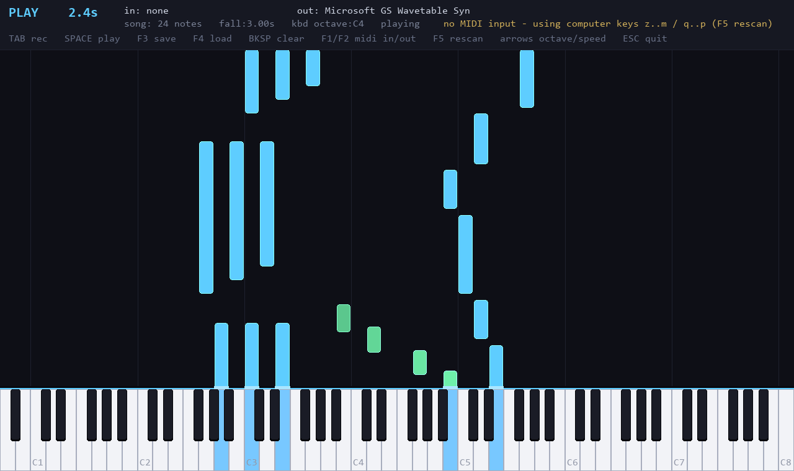

# PianoforteMaestro

Falling-note MIDI piano for Windows. Plug in a keyboard, record what you play,
and watch it fall back down onto an on-screen 88-key piano.



Blue notes are the song falling toward the keys. Green notes are what you just
played, rising away. Keys light up at the strike line as notes land on them.

## Requirements

Python 3.12 and three packages — `pygame`, `python-rtmidi`, `mido` — all of
which ship prebuilt wheels for Windows, so there is nothing to compile.

## Run

Double-click **`run.bat`**. The first run creates a `.venv` and installs the
three dependencies; after that it just launches.

A MIDI keyboard is optional. Without one the app says so and falls back to the
computer keyboard, so it is playable on any machine.

### Standalone exe

Double-click **`build.bat`** to produce `dist\PianoforteMaestro.exe` — one
self-contained ~16 MB file with no Python needed. Copy it anywhere and run it.

Two things to expect:

- **Slow first frame.** A one-file build unpacks to a temp folder on every
  launch, so there are a few seconds with nothing on screen before the window
  appears.
- **SmartScreen.** Running the exe where you built it is usually silent, but
  once it travels — downloaded, emailed, copied from a share — Windows marks it
  as from the internet and shows *"Windows protected your PC"*, because it is
  unsigned. Click **More info → Run anyway**.

Recordings are saved to a `songs\` folder **next to the exe**, so keep it
somewhere writable.

## The falling notes

The direction tells you which way time is running:

- **Playback** — notes descend from the top, and the bottom edge of a note
  touches the keys at the exact instant it sounds. There is a one-fall lead-in
  so the opening notes visibly drop in rather than appearing on the strike line.
- **Live** — you can't see the future, so notes you play *rise up off* the keys,
  fading as they go. Same geometry, opposite sign.

Both run at once, so you can **play along with a song**: its notes fall toward
the keys in blue while yours rise away in green. Playback and your own playing
track their sounding notes separately, so holding a key across the end of a song
doesn't strand it.

Note height is the note's duration, and the lane width is the real key width, so
a note always sits exactly over the key that plays it.

## MIDI

The app auto-connects to the first MIDI input it finds and prefers a hardware
output over the Windows software synth. Playback is sent to the MIDI output — a
connected keyboard voices it, and `Microsoft GS Wavetable Synth` is the
zero-config fallback that always exists on Windows.

Devices are switchable while running (`F1`/`F2`), with `F5` to rescan after
plugging something in. Windows MIDI ports are exclusive, so if another app holds
your keyboard the app reports the reason instead of failing silently.

> **Note:** this was developed without a MIDI keyboard attached. The hardware
> input path is implemented and the app degrades cleanly when no device is
> present, but real hardware input has not been tested. Reports welcome.

## Controls

| Key | Action |
| --- | --- |
| `TAB` | start / stop recording (starts a new take) |
| `SPACE` | play / stop the current song |
| `F3` | save the song to `songs/` as a real `.mid` |
| `F4` | load the next `.mid` in `songs/` |
| `BKSP` | clear the song |
| `F1` / `F2` | cycle MIDI input / output device |
| `F5` | rescan MIDI devices |
| `←` `→` | computer-keyboard octave down / up |
| `↑` `↓` | faster / slower fall |
| `ESC` | quit |

Mouse-click the on-screen keys to play them.

**Computer keyboard** (when no MIDI device is connected) — two rows laid out
like piano keys, the upper row one octave above the lower:

```
lower:  z s x d c v g b h n j m , l . ; /     (C  C# D  D# E  F  F# G ...)
upper:  q 2 w 3 e r 5 t 6 y 7 u i 9 o 0 p     (one octave up)
```

## Files

Recordings are standard MIDI files in `songs/`, so they open in any DAW or
notation app. Timing is kept internally in seconds and converted to ticks only
on save; on load, tempo changes are honoured, so multi-tempo files don't drift.

## How it works

- Single process, one 60 fps render loop. MIDI input arrives on rtmidi's own
  thread and is handed to the main loop through a queue; nothing else is touched
  from that thread.
- One clock (`time.perf_counter()`) drives recording, playback scheduling and
  rendering, so they can't disagree.
- One `key_rect()` function is the single source of truth for key geometry,
  shared by the keyboard renderer, the falling-note renderer and mouse
  hit-testing — which is why falling notes can't drift out of line with the keys
  they land on.

Run `run.bat --selftest` to check key geometry, the fall equation, MIDI file
round-tripping and the play-along state machine without opening a window. The
packaged exe is built `--windowed` and has no console, so run the selftest from
source.

## Repo layout

| Path | What |
| --- | --- |
| `piano.py` | the whole app, plus `--selftest` |
| `run.bat` | create the venv if needed, then launch |
| `build.bat` | selftest, then build `dist\PianoforteMaestro.exe` |
| `make_icon.py` | regenerates `icon.ico` (the only thing needing Pillow) |
| `songs/` | recordings, as `.mid` |
